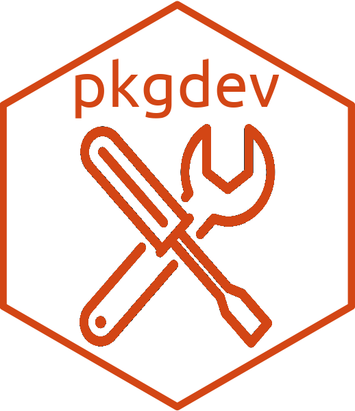

<!-- README.md is generated from README.qmd. Please edit that file -->

# pkgdev <a href='https://dieghernan.github.io/pkgdev/'></a>

<!-- badges: start -->

[](https://dieghernan.r-universe.dev/)
[](https://github.com/dieghernan/pkgdev/actions/workflows/check-full.yaml)
[](https://www.repostatus.org/#wip)
[](https://www.codefactor.io/repository/github/dieghernan/pkgdev)

<!-- badges: end -->

**pkgdev** provides helpers for package maintenance, documentation rendering
and [GitHub Actions](https://github.com/features/actions) workflows. It is
primarily intended for personal use, but you are welcome to use it at your own
risk.

## Installation

You can install the development version of **pkgdev** with:

```{r}
#| eval: false
pak::pak("dieghernan/pkgdev")
```

Alternatively, you can install **pkgdev** from
[r-universe](https://dieghernan.r-universe.dev/pkgdev):

```{r}
#| eval: false
# Install pkgdev in R:
install.packages("pkgdev", repos = c(
  "https://dieghernan.r-universe.dev",
  "https://cloud.r-project.org"
))
```

## Example

```{r}
#| eval: false
library(pkgdev)

gha_update_docs()
```

```{r}
#| echo: false
#| results: asis

cat(paste0(
  "Document created with package pkgdev **v",
  packageVersion("pkgdev"), "**."
))
```

## Related resources

- The [tidyverse style guide](https://style.tidyverse.org/).
- **ThinkR**: [Preparing your package for a CRAN
  submission](https://github.com/ThinkR-open/prepare-for-cran).
- Davis Vaughan: [extrachecks](https://github.com/DavisVaughan/extrachecks).
- The **usethis** package: [Create a release checklist in a GitHub
  issue](https://usethis.r-lib.org/reference/use_release_issue.html)
- The full [**usethis** package website](https://usethis.r-lib.org).
