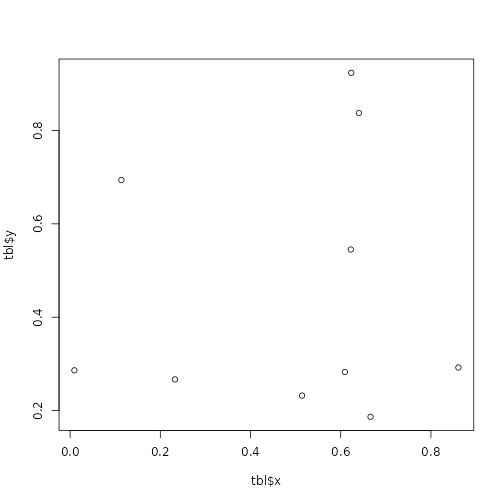

This is an example of a precomputed vignette:


```r
set.seed(1234)
tbl <- data.frame(x = runif(10), y = runif(10))
plot(x = tbl$x, y = tbl$y)
```




Another plot


```r
plot(x = tbl$y, y = tbl$x)
```


